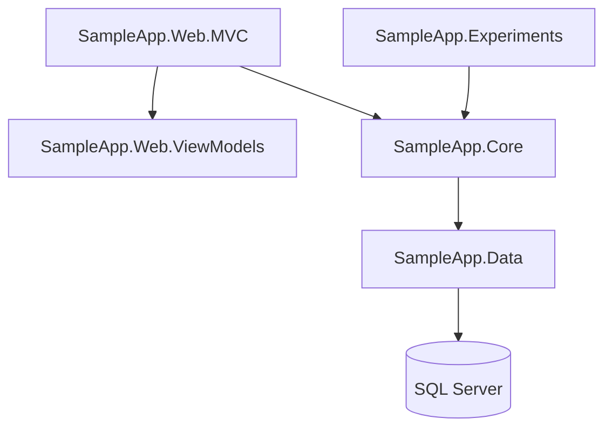
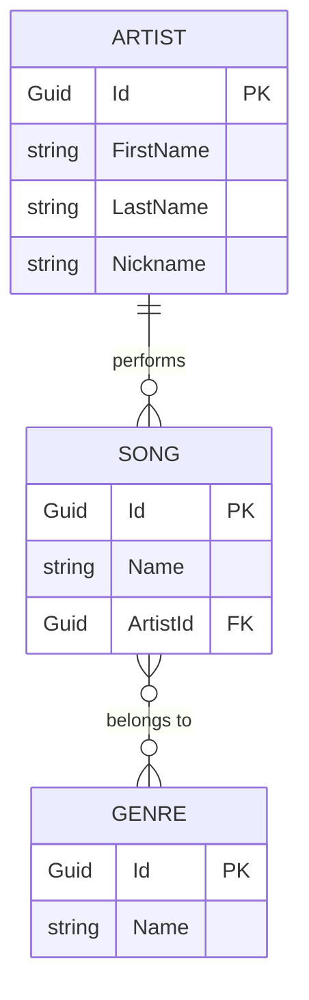
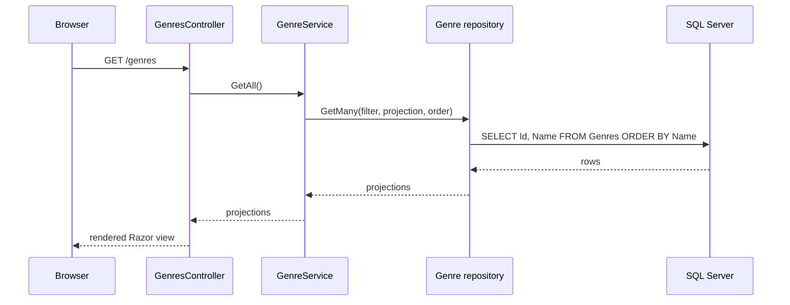

# SampleApp

A small music catalogue – artists, songs and genres – used as a playground for Entity Framework Core and ASP.NET Core MVC. The same data is reachable from a console menu and from a web page, so you can watch what SQL each of them produces.


[](https://sonarcloud.io/summary/new_code?id=AtanasG6_SampleApp)
[](https://sonarcloud.io/summary/new_code?id=AtanasG6_SampleApp)
[](https://sonarcloud.io/summary/new_code?id=AtanasG6_SampleApp)
[](https://sonarcloud.io/summary/new_code?id=AtanasG6_SampleApp)

## Projects



`SampleApp.Core` never returns an entity to the web layer – it returns a projection, which the controller maps to a view model.

## Domain model



The join table `GenreSong` has no class of its own – EF Core creates it by convention from the two collection navigations.

## A request



## Where to look

| Topic | File |
| --- | --- |
| Projections instead of `Include` | `SampleApp.Core/Services` |
| Change tracker states | `SampleApp.Experiments/Program.cs` |
| Migrations vs `EnsureCreated` | `SampleApp.Data/Migrations` |
| Many-to-many by convention | `Song.Genres`, `Genre.Songs` |
| Generic repository with sorting | `SampleApp.Data/Repositories`, `SampleApp.Data/Sorting` |
| Separate input and view models | `SampleApp.Web.ViewModels/Genres` |

## Running it

Needs the [.NET 10 SDK](https://dotnet.microsoft.com/download), SQL Server at `.`, and `dotnet tool install --global dotnet-ef`.

```bash
dotnet ef database update --project SampleApp.Data --startup-project SampleApp.Data -- "Server=.;Database=music;Integrated Security=True;TrustServerCertificate=True"
```

```bash
dotnet run --project SampleApp.Web.MVC
```

The console menu applies the migrations itself and prints every SQL statement it sends:

```bash
dotnet run --project SampleApp.Experiments
```

## Code quality

Analysed by [SonarQube Cloud](https://sonarcloud.io/summary/overall?id=AtanasG6_SampleApp) on every push and pull request.
