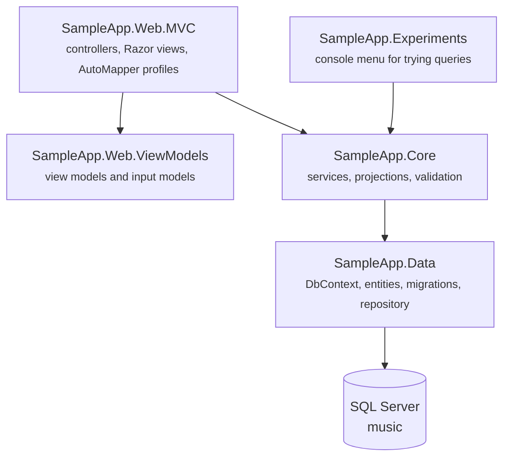
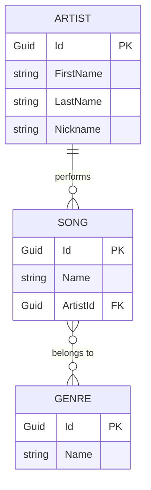

# SampleApp

A small music catalogue – artists, songs and genres – used as a playground for Entity Framework Core and ASP.NET Core MVC. Every layer is a separate project, so the same data can be reached from a console menu and from a web page and you can watch what SQL each of them produces.


[](https://sonarcloud.io/summary/new_code?id=AtanasG6_SampleApp)
[](https://sonarcloud.io/summary/new_code?id=AtanasG6_SampleApp)
[](https://sonarcloud.io/summary/new_code?id=AtanasG6_SampleApp)
[](https://sonarcloud.io/summary/new_code?id=AtanasG6_SampleApp)
[](https://sonarcloud.io/summary/new_code?id=AtanasG6_SampleApp)

## How the projects fit together



The arrows only point downwards. `SampleApp.Data` knows nothing about the layers above it, and `SampleApp.Core` never returns an entity to the web layer – it returns a projection, which the controller maps to a view model.

## Domain model



The many-to-many between songs and genres has no class of its own – EF Core creates the `GenreSong` join table by convention from the two collection navigations. All keys are `Guid`, generated on the client by `SequentialGuidValueGenerator`, so a new entity already has its id before `SaveChanges` is called.

## What a request goes through

```mermaid
sequenceDiagram
    participant B as Browser
    participant C as GenresController
    participant S as GenreService
    participant R as Repository&lt;Genre&gt;
    participant DB as SQL Server

    B->>C: GET /genres
    C->>S: GetAll()
    S->>R: GetMany(filter, projection, order)
    R->>DB: SELECT Id, Name FROM Genres ORDER BY Name
    DB-->>R: rows
    R-->>S: GenreGeneralInfoProjection[]
    S-->>C: projections
    C->>C: AutoMapper: projection to view model
    C-->>B: rendered Razor view
```

Because the projection is not an entity, the query is automatically no-tracking and only the columns that are actually displayed leave the database.

## Things demonstrated here

| Topic | Where to look |
| --- | --- |
| Projections instead of `Include` | `SampleApp.Core/Services/*Service.cs` – the commented alternatives are kept on purpose |
| Change tracker states | `SampleApp.Experiments/Program.cs` – entries in `Added` state before `SaveChanges` |
| Migrations vs `EnsureCreated` | `SampleApp.Data/Migrations` and `InitializeDatabase` in the console project |
| Many-to-many by convention | `Song.Genres` / `Genre.Songs`, migration `AddGenre` |
| Generic repository with sorting | `SampleApp.Data/Repositories`, `SampleApp.Data/Sorting` |
| Reading the generated SQL | `optionsBuilder.LogTo(Console.WriteLine, LogLevel.Information)` |
| Separate input and view models | `SampleApp.Web.ViewModels/Genres` |

## Getting started

You need the [.NET 10 SDK](https://dotnet.microsoft.com/download), a SQL Server instance reachable at `.`, and the EF Core CLI:

```bash
dotnet tool install --global dotnet-ef
```

The connection string is hardcoded in `SampleApp.Web.MVC/Program.cs` and in `SampleApp.Experiments/Program.cs`:

```
Server=.;Database=music;Integrated Security=True;TrustServerCertificate=True
```

Create the database. The design time factory takes the connection string as an argument, and `Microsoft.EntityFrameworkCore.Design` lives in `SampleApp.Data`, so that project is both the target and the startup project:

```bash
dotnet ef database update --project SampleApp.Data --startup-project SampleApp.Data -- "Server=.;Database=music;Integrated Security=True;TrustServerCertificate=True"
```

Then run the web application:

```bash
dotnet run --project SampleApp.Web.MVC
```

Or the console menu, which applies the migrations itself on startup and prints every SQL statement it sends:

```bash
dotnet run --project SampleApp.Experiments
```

## Code quality

Every push to `master` and every pull request is analysed by [SonarQube Cloud](https://sonarcloud.io/summary/overall?id=AtanasG6_SampleApp) through Automatic Analysis, so findings arrive as pull request comments without any CI configuration.

## Known gaps

- The connection string is not read from `appsettings.json` yet
- `Artist` has no repository or service registration in the web project, so `ArtistsController.Details` is still a stub
- Songs and artists have no create, edit or delete pages – only genres do
- No test projects, so there is no coverage to report
